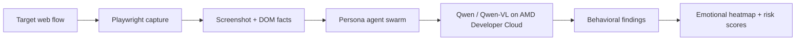

# AMD Developer Hackathon Plan

## Product framing

Faultline is Behavioral Failure Simulation for software teams.

Instead of asking "did the button work?", teams ask:

- Would a stressed single parent misunderstand checkout?
- Would a low-tech older adult get stuck during signup?
- Would a non-native speaker misread the final confirmation?
- Would a scammer find a refund or support exploit path?
- Would visual clutter cause users to abandon?

## Tracks

Primary: AI Agents & Agentic Workflows.

Secondary: Vision & Multimodal AI.

The multimodal claim is real because the system captures page screenshots and asks a vision-language model to reason about layout, forms, visual hierarchy, button wording, density, and emotional failure hotspots.

## Architecture

## AMD GPU use

The local app already supports an OpenAI-compatible model endpoint. On AMD Developer Cloud, run vLLM or another ROCm-compatible serving stack on MI300X, then point `OPENAI_COMPAT_CHAT_URL` to that endpoint.

For the demo, show:

- 6 persona agents running against a real signup or checkout flow.
- Screenshot understanding with Qwen-VL.
- A before/after run after improving the target UI.
- Parallel batch simulation plan: hundreds of personas and pages across AMD GPUs.

## Judging criteria mapping

Application of Technology:
Uses Playwright, multimodal LLMs, persona agents, Qwen/Qwen-VL, and AMD-hosted GPU inference.

Presentation:
The demo produces visual heatmaps and concrete findings, making it easy to show business impact.

Business Value:
Teams can identify conversion, trust, accessibility, support, and abuse risks before release.

Originality:
Frames the category as Synthetic Human Testing and Behavioral Failure Simulation, not generic UI testing.

## Build in Public checklist

- Post 1: "We are building Faultline, synthetic human testing for pre-release behavioral failure simulation." Tag lablab and AMD.
- Post 2: Share a screenshot of emotional heatmaps and explain what AMD-hosted Qwen-VL found.
- Include feedback about AMD Developer Cloud setup, ROCm model serving, and GPU inference throughput.

## Next technical milestones

- Add browser recording upload for private flows.
- Add batch mode for sitemap/page-list simulation.
- Add before/after regression comparison.
- Add Hugging Face Space deployment.
- Add persistent run history and exportable PDF report.
